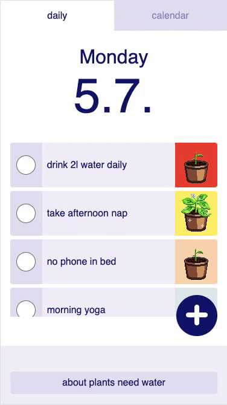

# plants need water

> A habit tracking app with a focus on self compassion instead of self optimisation.



[Try it out!\*](https://plants-need-water.herokuapp.com/)

\*\*The deployment takes a little longer to load the first time because Heroku's servers fall asleep. The app is designed for mobile. For a better experience, open the dev tools and switch to mobile view.

## Installing

```shell
# install dependencies
npm install

# serve with hot reload at localhost:3000
npm run client:dev

# build for production
npm run build
npm start

# run storybook
npm run storybook
```

## About the App

When I first started my coding journey, in the very first JavaScript tutorial I did, there was an assignment to write an if statement. The goal was to write a function that would check the current weekday and return if it was time to water the plants. So on a certain day the function would return ‘plants need water’. This expression became the catchphrase for my coding journey: should I go outside or should I do the next chapter of the tutorial? Well, plants need water, so coding it is.

The metaphor is simple. And so is the concept it represents. If you want to grow or evolve in any area, you need to tend to it. water it, so it can grow.

In a society that worships busyness, we measure everything we do in terms of how productive it makes us. Even selfcare gets turned into #selfcare, a means to an end. Taking care of yourself so you can keep on hustling.

Plants need water strives to support you in your growth without adding pressure. It shifts the focus from performance at any cost to nurturing the inner plant.
